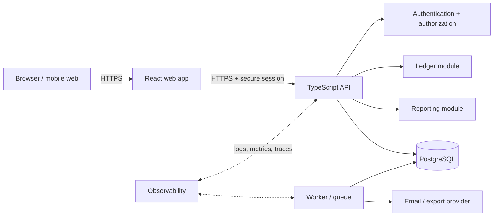
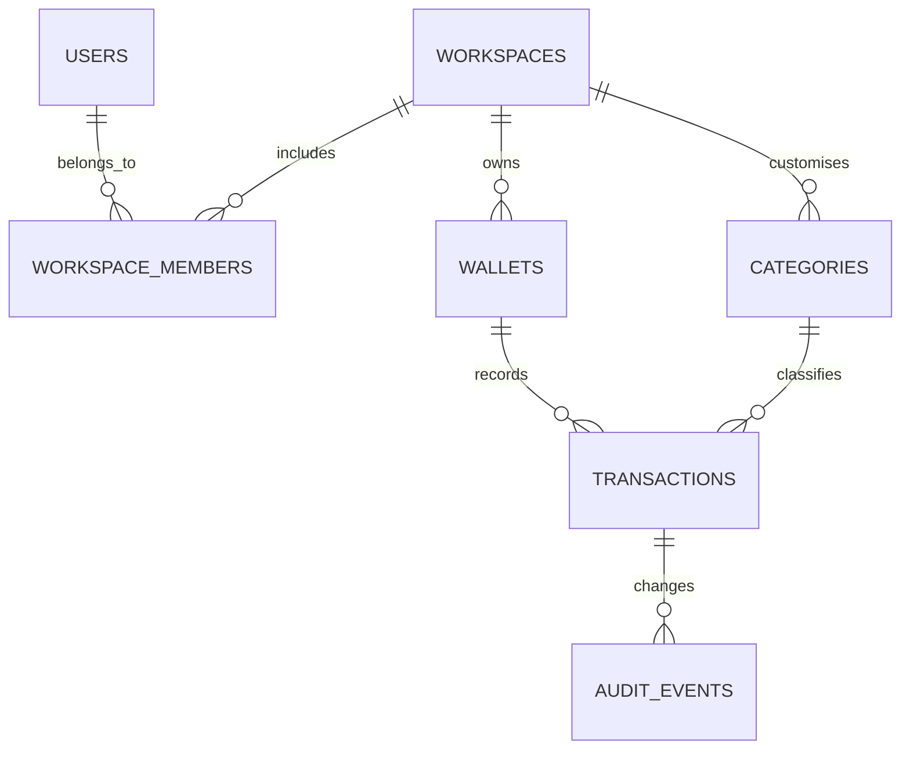

# bucks — production architecture plan

## 1. What we are building

bucks is a personal-first money journal: a user can log income and expenses in seconds, understand a current balance, group spending by category, and review meaningful monthly trends.

The product should **not** begin as a bank or a full accounting suite. Its first promise is reliable, low-friction tracking. Bank feeds, multi-person workspaces, exports, and recurring rules can come after the core daily habit works.

### Product boundaries for v1

- One user owns one or more wallets (cash, bank, card).
- A transaction is income, expense, or transfer; it has a date, amount, currency, category, wallet, and optional note.
- Users can create, edit, delete, filter, and export their own transactions.
- Dashboards are derived from the transaction ledger; never maintained as a separate editable source of truth.

## 2. Recommended production shape

Keep the first production deployment a **modular monolith**: one TypeScript application, one PostgreSQL database, and one worker process. It is dramatically easier to operate than microservices, while keeping clean boundaries for later extraction.



### Concrete stack

| Concern         | Start with                                       | Why                                                                                       |
| --------------- | ------------------------------------------------ | ----------------------------------------------------------------------------------------- |
| Web client      | Current React + Vite app                         | Fast development and a small, responsive client.                                          |
| API             | Node.js + TypeScript + Fastify                   | One codebase/language; strongly typed request validation.                                 |
| Database        | Managed PostgreSQL                               | Transactions, constraints, indexes, backups, and reporting queries are all a natural fit. |
| Data access     | Drizzle ORM or Prisma                            | Migrations plus typed query boundaries. Pick one; do not mix.                             |
| Authentication  | A managed auth provider or Better Auth           | Password/session security should not be hand-built.                                       |
| Background work | Managed queue / worker                           | Exports, reminders, and monthly summaries must not hold up an API request.                |
| Hosting         | CDN for web + managed container/serverless API   | Independent deploys and simple rollback.                                                  |
| Monitoring      | Error tracking + structured logs + uptime checks | Know when logging, export, or sync fails before users do.                                 |

## 3. Module boundaries

The API is one deployable application but is organized by domain. A route must call a domain service; it must not issue arbitrary database queries itself.

```text
apps/
  web/                 React UI, route-level data fetching, offline outbox
  api/
    auth/              session verification and workspace membership
    wallets/           wallet CRUD and opening balances
    ledger/            transaction and transfer rules
    categories/        defaults and user customisation
    reports/           read-only aggregation queries
    exports/           export request and download records
    shared/            validation, errors, time, money, audit logging
  worker/              scheduled summaries and exports
packages/
  contracts/           request/response schemas shared by client and API
```

The important rule is that **ledger owns money movement**. A report never changes a transaction. A wallet balance is either calculated from ledger movements or maintained as a carefully tested projection; it is never typed manually after creation.

## 4. Data model

All money values are signed integers in the smallest currency unit: `38000` paise means ₹380.00. Never use a floating-point number for money.



### Required tables

| Table               | Important fields                                                                                                                                      | Purpose                                                    |
| ------------------- | ----------------------------------------------------------------------------------------------------------------------------------------------------- | ---------------------------------------------------------- |
| `users`             | `id`, `email`, `created_at`                                                                                                                           | Identity only; delegate password/session storage to auth.  |
| `workspaces`        | `id`, `name`, `base_currency`, `owner_id`                                                                                                             | Personal space now; shared household/business later.       |
| `workspace_members` | `workspace_id`, `user_id`, `role`                                                                                                                     | Authorization boundary.                                    |
| `wallets`           | `id`, `workspace_id`, `name`, `kind`, `opening_balance_minor`, `currency`                                                                             | Cash, bank, card, or virtual wallet.                       |
| `categories`        | `id`, `workspace_id`, `name`, `kind`, `color`                                                                                                         | Seed global defaults, allow workspace-specific ones.       |
| `transactions`      | `id`, `workspace_id`, `wallet_id`, `category_id`, `kind`, `amount_minor`, `currency`, `occurred_at`, `note`, `created_at`, `updated_at`, `deleted_at` | Immutable economic record; soft-delete for recovery/audit. |
| `transaction_links` | `transaction_id`, `counterparty_transaction_id`                                                                                                       | Connects the two legs of a transfer.                       |
| `audit_events`      | `id`, `workspace_id`, `actor_id`, `entity_type`, `entity_id`, `action`, `before`, `after`, `created_at`                                               | Support, recovery, and security trail.                     |

Critical indexes: `(workspace_id, occurred_at desc)`, `(workspace_id, wallet_id, occurred_at desc)`, `(workspace_id, category_id, occurred_at desc)`, and partial indexes excluding soft-deleted transactions.

## 5. Key request flows

### Add an expense

1. Client validates the form immediately and creates an optimistic row with a client-generated UUID.
2. `POST /v1/workspaces/:workspaceId/transactions` sends an idempotency key and the transaction payload.
3. API authenticates the session, confirms membership, verifies the wallet/category belong to the workspace, validates amount/currency/date, and writes the transaction plus audit event in one database transaction.
4. API returns the canonical record. The client replaces its optimistic row.
5. If offline, the client puts the command into a local outbox and retries with the same idempotency key after reconnecting.

### Monthly dashboard

The report route accepts a date range and wallet/category filters. It reads transaction records and returns:

- total income, total expense, and net movement;
- daily spending series;
- spending by category; and
- recent activity page.

For v1, aggregate in PostgreSQL at read time. Only add materialized daily/monthly rollups if production metrics prove these queries are slow.

## 6. API contract, first release

```text
POST   /v1/workspaces
GET    /v1/workspaces/:id/dashboard?from=&to=
GET    /v1/workspaces/:id/transactions?cursor=&categoryId=&walletId=
POST   /v1/workspaces/:id/transactions       Idempotency-Key required
PATCH  /v1/transactions/:id
DELETE /v1/transactions/:id                   soft delete
GET    /v1/workspaces/:id/wallets
POST   /v1/workspaces/:id/wallets
POST   /v1/workspaces/:id/exports
```

Use cursor pagination, ISO-8601 timestamps in UTC, explicit request/response schemas, and one error shape: `{ "code": "...", "message": "...", "requestId": "..." }`. Do not leak database models directly in API responses.

## 7. Security and privacy baseline

Financial data needs a stronger-than-usual baseline even before bank connections exist.

- Every query that accepts a resource ID must also enforce workspace membership server-side. Broken object-level authorization is a common API risk, so client-side hiding is never a security control. [OWASP API Security guidance](https://owasp.org/www-project-api-security/)
- Use HTTPS, secure `HttpOnly`/`SameSite` session cookies, CSRF protection for cookie-authenticated state-changing calls, and rate limits on login and export endpoints.
- Encrypt data in transit and at rest.
- Log request IDs and security-relevant audit events, but redact notes, session tokens, and raw money data from general logs.
- Provide account export and deletion workflows; set backups, retention, and restoration drills before launch.
- Use a least-privilege database role. Secrets belong in the deployment platform’s secret manager, never source control.

## 8. Production readiness gates

Do not call the app production-ready until these are true:

- [ ] A user cannot read, write, or delete another workspace’s data (automated authorization tests).
- [ ] Duplicate submit/retry cannot create duplicate money movements (idempotency test).
- [ ] Currency, negative amount, future-date, category, and transfer validations are covered.
- [ ] Database migrations are forward-only, reviewed, and tested on a copy of production data.
- [ ] Automated daily backups exist and a restore has been performed successfully.
- [ ] Error tracking, structured logs, uptime checks, and database alarms are live.
- [ ] CI runs type checks, unit tests, API integration tests, and a browser smoke test.
- [ ] A staging environment mirrors production configuration without real user data.
- [ ] Privacy policy, terms, support route, retention policy, and incident runbook are ready.

## 9. Delivery roadmap

### Phase 0 — foundation (week 1)

Keep the current Vite app. Add routing, a typed client state boundary, unit tests for money/date helpers, and a component test for creating/deleting an entry. Keep `localStorage` as a demo-only store.

### Phase 1 — trustworthy cloud ledger (weeks 2–3)

Provision staging PostgreSQL. Build authentication, workspaces, wallets, categories, transactions, authorization middleware, migrations, and the dashboard/report endpoint. Move the UI from `localStorage` to the API, retaining a small offline outbox.

**Release criterion:** a signed-in user can use two devices without losing or duplicating a transaction.

### Phase 2 — useful finance experience (weeks 4–5)

Add transaction editing, soft-delete/recovery, transfers, wallet balances, budgets, search/filter, and CSV export. Add export jobs and email/download delivery.

**Release criterion:** a user can completely replace a basic spreadsheet for monthly tracking.

### Phase 3 — hardening and beta (weeks 6–7)

Add observability, load testing, backup restore exercise, security review, accessibility review, analytics with privacy controls, feedback/support, onboarding, and staged beta rollout.

**Release criterion:** the production-readiness checklist above is green and the beta has no unresolved data-integrity issue.

### Phase 4 — only after retention proves value

Recurring transactions, shared workspaces, richer reporting, notifications, and bank imports. Treat direct bank connectivity as a separate compliance/security project; do not bolt it into the first public release.

## 10. Decisions needed before implementation

1. Is bucks personal-only at launch, or do we support households/small-business teams from day one?
2. Is India/INR the only launch market? If yes, design with currency fields anyway, but focus the UX and exports around INR.
3. Do we need offline-first behavior in the first cloud version, or can sync require connectivity?
4. Are exports a launch feature or a beta feature?

My recommendation: launch as **personal, INR-first, online-capable with an offline entry outbox, no bank connection**, then expand from verified user behavior.
