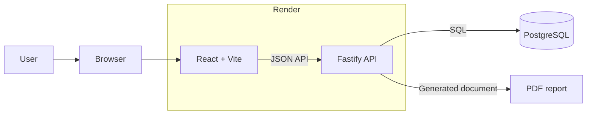
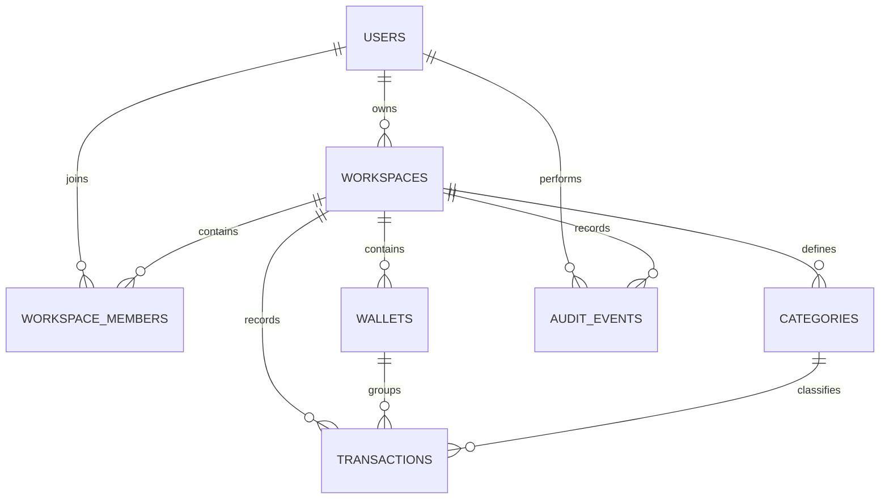
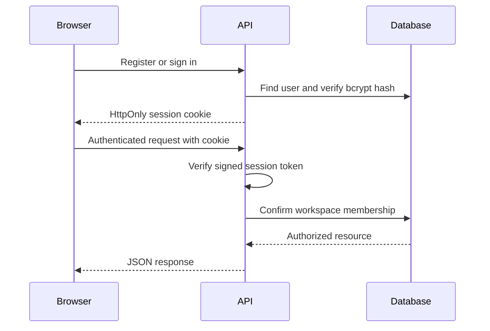

# bucks — system architecture

## Overview

bucks is a personal money journal for tracking income and expenses across separate books such as bank accounts, cash, cards, business spending, or savings goals.

The application follows a three-tier architecture:

1. A React browser client presents the interface and calls the API.
2. A Fastify service handles authentication, validation, authorization, ledger operations, analytics, and PDF generation.
3. PostgreSQL stores users, books, categories, entries, memberships, and audit history.

## System diagram



The React application and Fastify API share one TypeScript repository. In the hosted application, Fastify also serves the compiled React files. The API connects to PostgreSQL through a pooled connection.

## Application components

### React client

The client is responsible for:

- the public landing page and budget calculator;
- registration, sign-in, and sign-out screens;
- book, entry, category, and filter interfaces;
- overall and per-book analytics;
- light and dark themes; and
- typed API requests with cookie-based sessions.

UI code is divided into pages, layout components, reusable components, modal forms, formatting utilities, and a typed API client.

### Fastify API

The API is responsible for:

- validating request data with Zod;
- creating and verifying session tokens;
- enforcing workspace ownership on every private resource;
- applying book, category, and ledger rules;
- calculating balances and grouped analytics;
- generating filtered PDF reports;
- recording changes in the audit log; and
- returning a consistent JSON error structure.

Routes are grouped by authentication, dashboards, books, entries, and categories. Shared helpers handle authorization, audit records, database filters, session cookies, and response mapping.

### PostgreSQL

PostgreSQL is the source of truth for financial records. Foreign keys preserve relationships, check constraints validate domain values, unique constraints prevent duplicates, and indexes support the most common book and date-range queries.

Money is stored in integer minor units. For example, ₹125.50 is represented as `12550`, avoiding floating-point rounding errors.

### Render

Render is the cloud application host used by bucks. It runs the Node.js service, serves the web application through Fastify, provides the public HTTPS address, restarts the service when required, and makes application logs available. PostgreSQL remains a separate data service connected to the API over an encrypted connection.

## Repository structure

```text
.
├── apps/api/
│   ├── migrations/       PostgreSQL schema changes
│   ├── scripts/          Database migration runner
│   ├── src/              Fastify API and domain logic
│   └── test/             API integration tests
├── docs/                 System documentation
├── src/
│   ├── components/       Reusable React components and forms
│   ├── layout/           Authenticated application shell
│   ├── pages/            Landing, calculator, dashboard, and book pages
│   ├── utils/            Display and formatting helpers
│   ├── api.ts            Typed browser API client
│   └── Root.tsx          Application routing and session state
├── compose.yaml          Local PostgreSQL service
├── render.yaml           Render service definition
└── vite.config.ts        Frontend tooling and local API proxy
```

## Data model



| Table               | Responsibility                                                   |
| ------------------- | ---------------------------------------------------------------- |
| `users`             | Account identity and bcrypt password hash                        |
| `workspaces`        | Top-level ownership boundary for one user’s data                 |
| `workspace_members` | User-to-workspace authorization relationship                     |
| `wallets`           | Books representing cash, bank, card, business, or other accounts |
| `categories`        | Reusable classifications for both income and expenses            |
| `transactions`      | Cash-in and cash-out ledger entries                              |
| `audit_events`      | Before-and-after history for important changes                   |

The database uses the table name `wallets` for historical migration compatibility, while the interface calls these records books.

## Authentication and authorization



Registration is restricted to an allowlist of at most ten unique email addresses. A serialized database check also limits the total number of accounts to ten.

Passwords are accepted only by the authentication endpoints. They are hashed with bcrypt before storage, excluded from API responses, and redacted from application logs. Session tokens are stored in `HttpOnly`, `SameSite` cookies and authentication responses are marked `no-store`.

Every query for a private book, category, entry, or dashboard verifies that the authenticated user belongs to the corresponding workspace. A missing or unauthorized resource is returned as not found, which avoids revealing whether another user owns it.

## Ledger flow

When a user creates an entry:

1. The React form validates the visible fields.
2. The client sends the amount, type, category, date, payment mode, note, and an idempotency key.
3. The API validates the complete payload and verifies ownership of the selected book and category.
4. PostgreSQL writes the entry once; the unique idempotency key prevents duplicate submissions.
5. The API records an audit event and returns the saved entry.
6. The client reloads the book summary and analytics from the ledger.

Opening balances are represented as system-generated ledger entries. Deleted entries use soft deletion, allowing them to be restored while preserving their history.

## Analytics and reporting

Dashboard values are derived from ledger records rather than stored as editable totals. PostgreSQL aggregation queries calculate:

- current balances;
- total income and expenses;
- spending grouped by category;
- spending grouped by payment mode; and
- recent activity.

Date, category, entry type, payment mode, and search filters are applied on the server. The same filtered data can be rendered as a PDF report by the API.

## Local runtime

During local development, Vite serves the React client, Fastify runs as a separate Node.js process, and Docker Compose runs PostgreSQL. Vite proxies `/v1` API requests to Fastify, allowing the browser client to use the same relative API paths as the hosted application.
